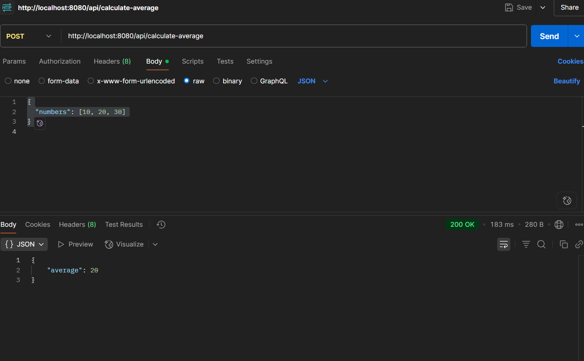
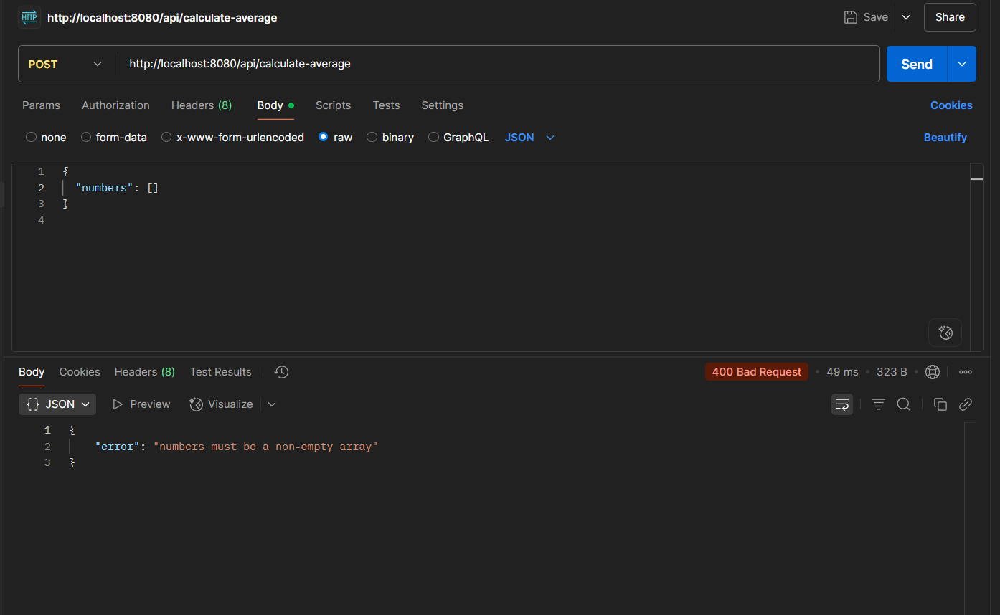
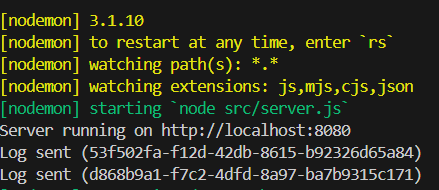

# 📊 Affordmed Backend Test – Average Calculator API

This backend service accepts an array of numbers and returns their average. It is built with **Node.js** and **Express**, and integrates with a custom **Logging Middleware** to send logs to the Affordmed evaluation server.

---

## Features

- POST API to calculate average
- Input validation with descriptive errors
- Reusable external Logging Middleware
- Production-grade folder structure
- Logs all critical steps: success, validation failure, and internal errors

---

## Project Structure

 Backend Test Submission/
├── src/
│ ├── config/ # Config and constants
│ ├── controller/ # Request handlers
│ ├── middleware/ # Middleware for logging
│ ├── routes/ # API routes
│ └── server.js # Server entry point
├── .env.example # Template for environment variables
├── package.json
├── .gitignore
├── README.md # This file
└── screenshots/ # Output screenshots (optional)

## Screenshots

###  Success (valid input)

###  Error (non-numeric input)

### Log Middleware Output

